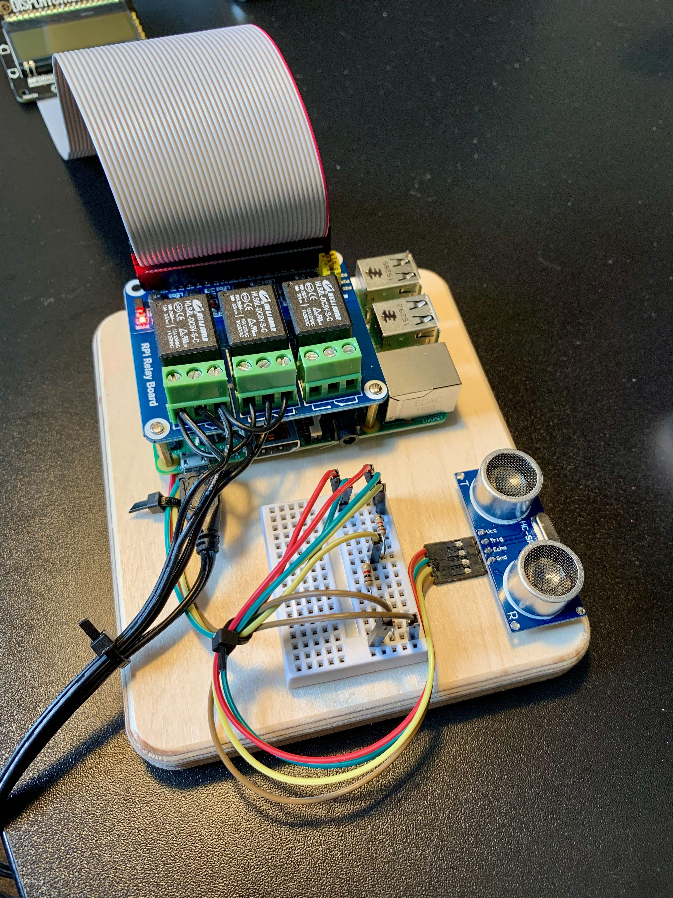

A Raspberry Pi controller for my Conset 501-49 standing desk:



It includes:

- Raspberry Pi B+
- [Displayotron LCD display and buttons](https://shop.pimoroni.com/products/display-o-tron-hat)
- [Relay Board](https://thepihut.com/products/raspberry-pi-relay-board)
- [Ultrasonic distance sensor](https://thepihut.com/blogs/raspberry-pi-tutorials/hc-sr04-ultrasonic-range-sensor-on-the-raspberry-pi)

This controller measures the height of the table from the floor via the distance center and uses the on-board relay to control the desk's motor to move up/down. Redis is used for sending commands to the relay script, meaning it can also be controller via Homebridge/Apple home (see the `homebridge-standing-desk` plugin repo).

## Setup

Install Redis:

```sh
sudo apt-get install redis
sudo update-rc.d redis-server defaults
```

Install Python deps:

```sh
pip install -r requirements.txt
```

Install supervisord

```sh
sudo apt-get install supervisor
```

And add the configuration file:

```sh
sudo cp ./etc/supervisor.conf /etc/supervisor/conf.d/standing-desk.conf
```